# SELASAR - System Architecture & Flow Diagrams

## 📐 System Architecture Diagram

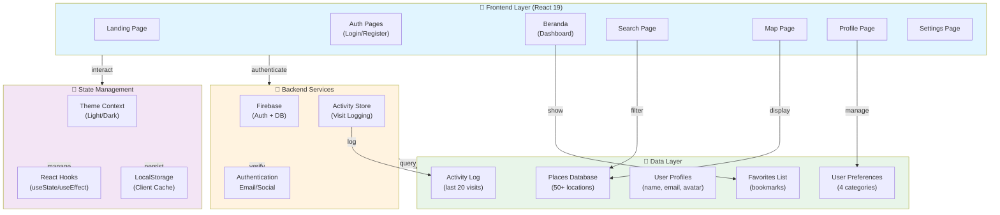

---

## 🔄 User Authentication Flow

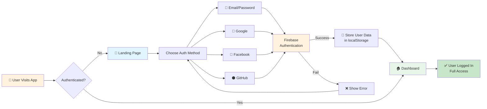

---

## 🔎 Search & Discovery Flow

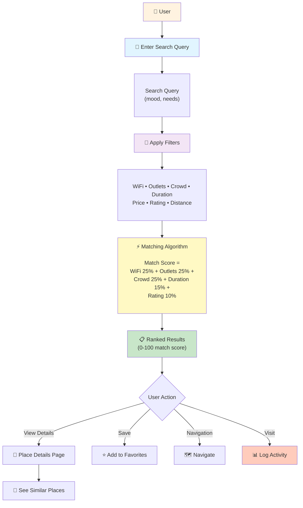

---

## 📍 Place Data Structure

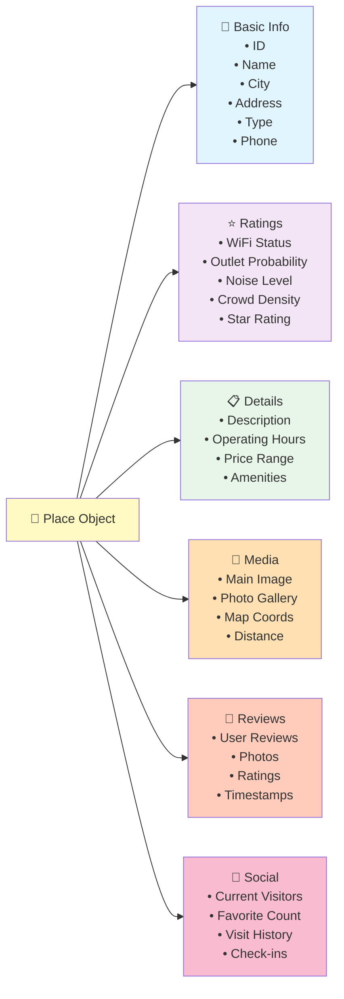

---

## 🎯 User Preference System

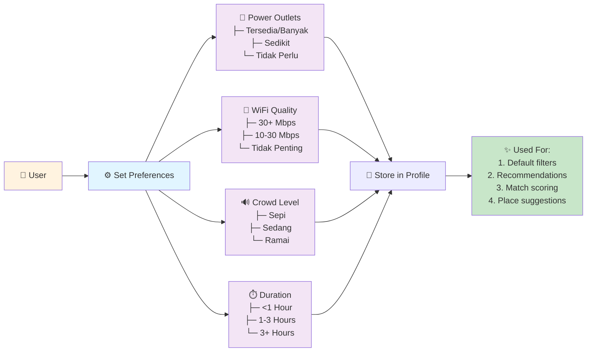

---

## 📊 Activity & Analytics Flow

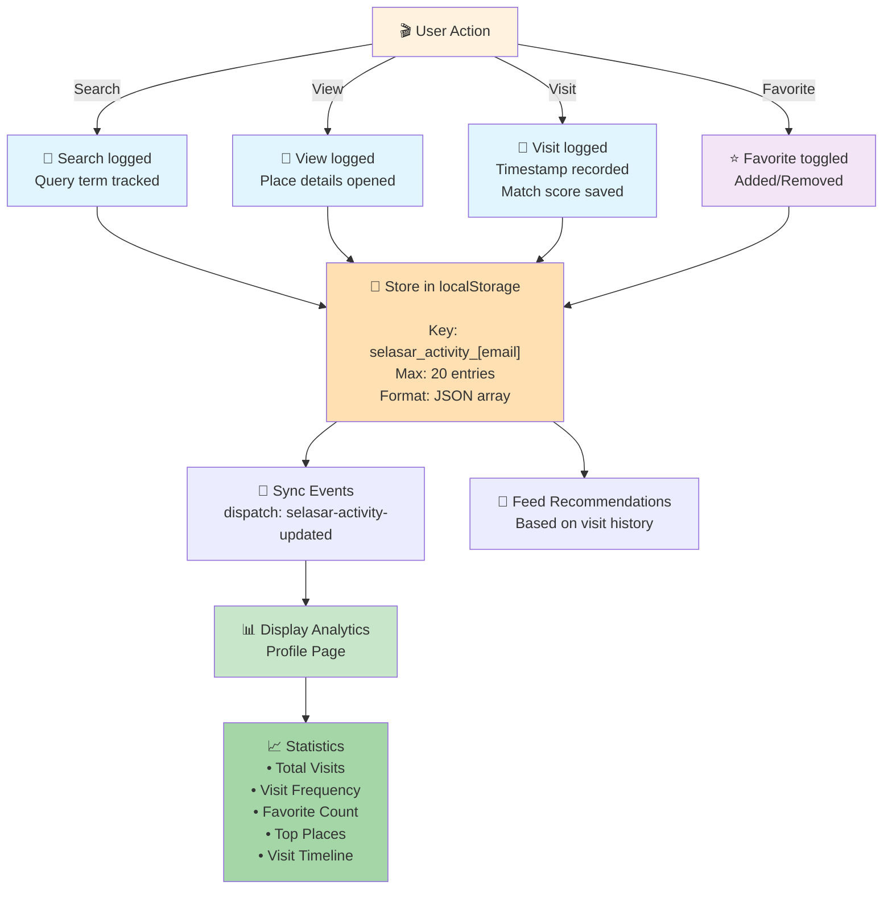

---

## 🎨 Theme Switching Flow

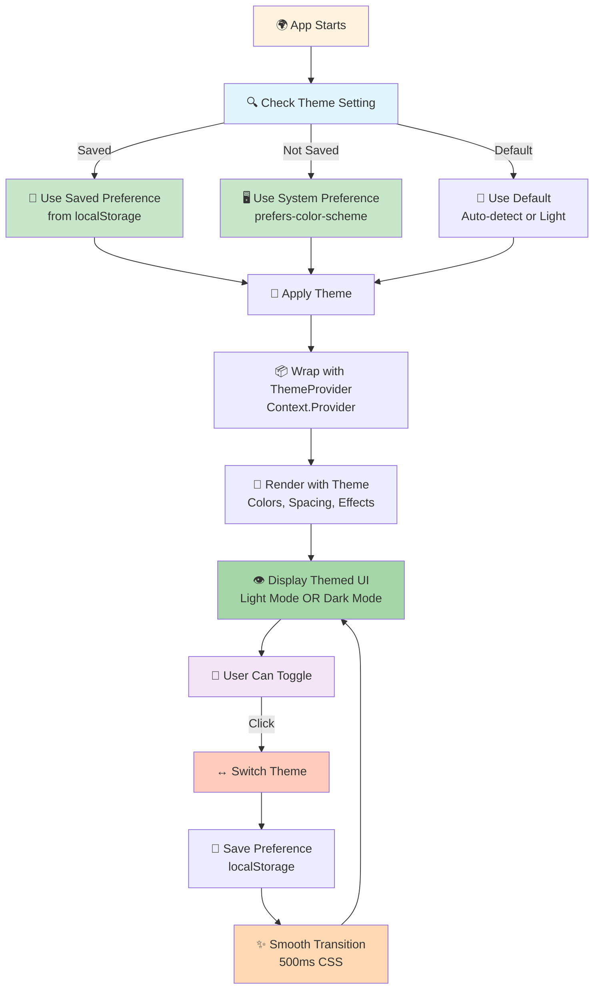

---

## 📱 Navigation Routes Map

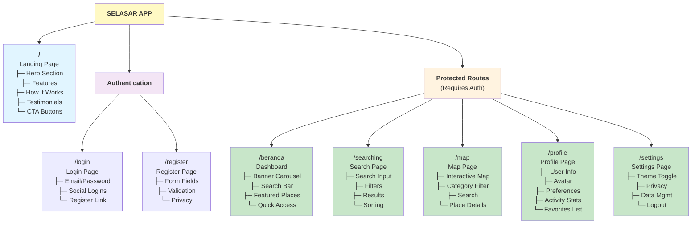

---

## 💾 Data Persistence Strategy

```mermaid
graph LR
    subgraph Session["🌐 User Session"]
        User["👤 User Actions"]
    end

    subgraph Memory["💭 In-Memory<br/>(React State)"]
        State1["User Profile"]
        State2["Preferences"]
        State3["Current Search"]
        State4["UI State"]
    end

    subgraph Local["📱 LocalStorage<br/>(Browser)"]
        Local1["User Data<br/>selasarUser"]
        Local2["Activity History<br/>selasar_activity_[email]"]
        Local3["Favorites<br/>selasar_favorites_[email]"]
        Local4["Theme Pref<br/>selasar-dark-mode"]
        Local5["Avatars<br/>selasarAvatar_[email]"]
    end

    subgraph Cloud["☁️ Firebase"]
        Cloud1["Authentication<br/>Email/Social"]
        Cloud2["User Profiles<br/>(future)"]
        Cloud3["Place Data<br/>(future)"]
        Cloud4["Reviews<br/>(future)"]
    end

    User -->|type/click| Memory
    Memory -->|on change| Local
    Local -->|sync| Cloud
    Cloud -->|restore| Memory
    Memory -->|render| User

    style User fill:#fff3e0
    style Memory fill:#e1f5ff
    style Local fill:#ffe0b2
    style Cloud fill:#fff9c4
```

---

## 🚀 Deployment Architecture

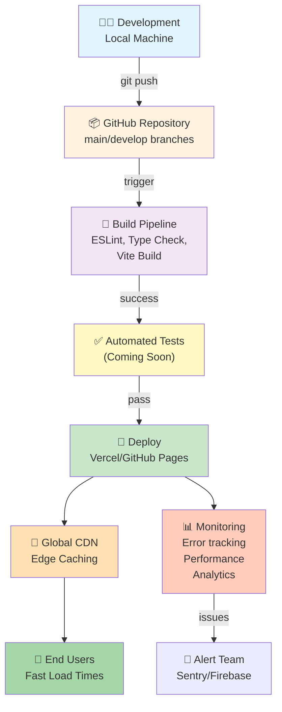

---

## 📈 Growth & Scaling Strategy

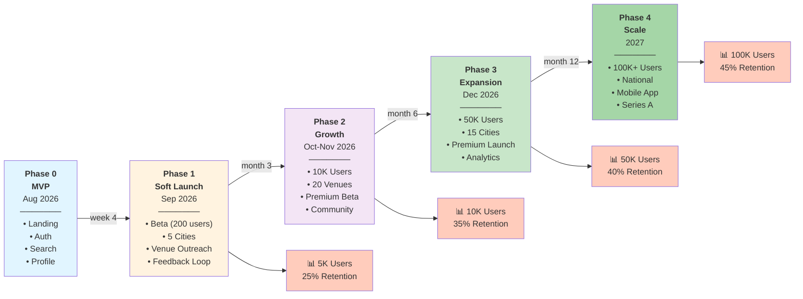

---

## 🔒 Security & Privacy Flow

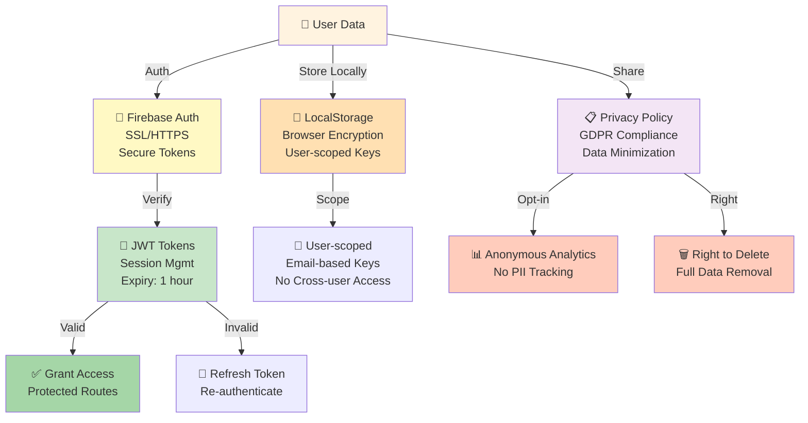

---

## 🎯 Feature Dependency Map

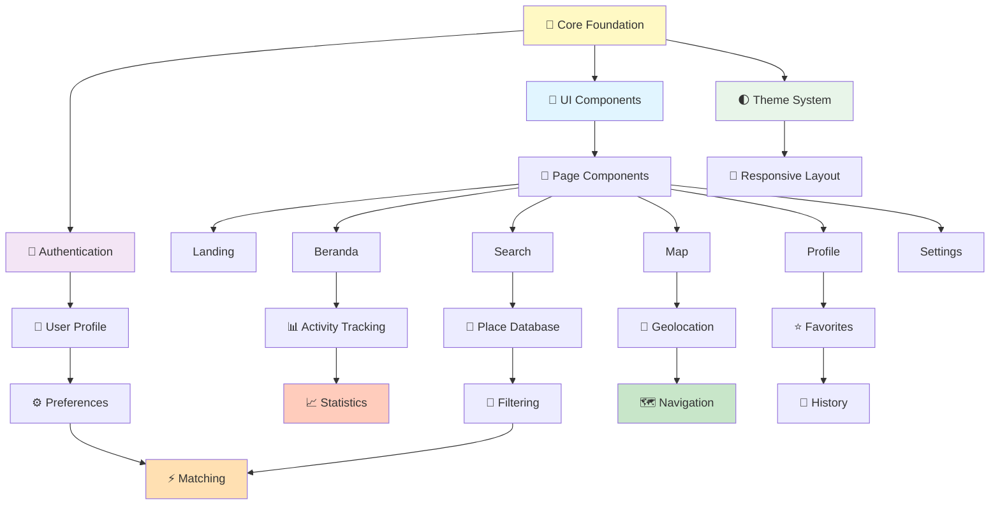

---

## 📞 API Request/Response Flow (Future)

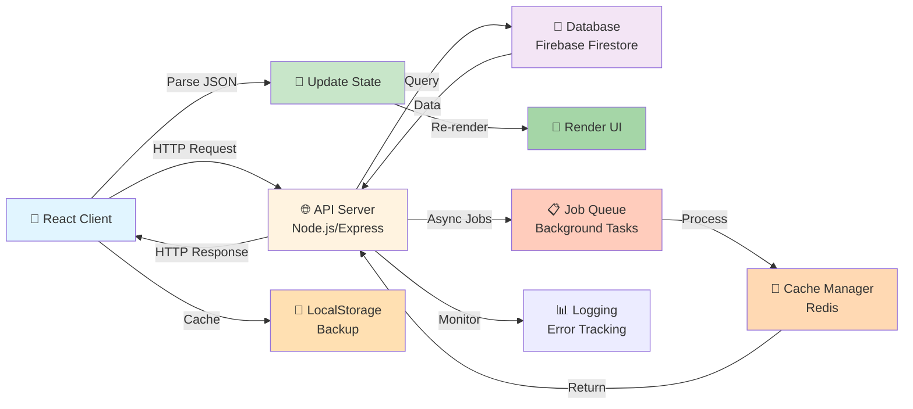

---

## 🎭 Component Hierarchy

```
App.jsx (Root)
├── ThemeProvider
│   └── Router
│       └── Routes
│           ├── Landing.jsx
│           │   ├── Hero Section
│           │   ├── Features Cards
│           │   ├── How-to Section
│           │   ├── Testimonials
│           │   └── Footer
│           │
│           ├── Login.jsx
│           │   ├── Form
│           │   └── OAuth Buttons
│           │
│           ├── Register.jsx
│           │   ├── Form
│           │   └── OAuth Buttons
│           │
│           ├── Beranda.jsx
│           │   ├── Header/Logo
│           │   ├── Search Bar
│           │   ├── Banner Carousel
│           │   └── Place Grid
│           │
│           ├── Searching.jsx
│           │   ├── Search Input
│           │   ├── Filter Panel
│           │   ├── Sort Options
│           │   └── Results Grid
│           │
│           ├── Map.jsx
│           │   ├── Map Container
│           │   ├── Category Filter
│           │   ├── Place Markers
│           │   └── Info Window
│           │
│           ├── Profile.jsx
│           │   ├── User Header
│           │   ├── Stats Section
│           │   ├── Preferences Panel
│           │   ├── Activity History
│           │   └── Favorites List
│           │
│           └── Settings.jsx
│               ├── Theme Toggle
│               ├── Privacy Settings
│               ├── Data Management
│               └── Logout
```

---

## 📊 Database Schema (Planned)

```
USERS Collection
├── uid (string) - Firebase UID
├── email (string)
├── name (string)
├── avatar (string) - base64 or CDN URL
├── bio (string)
├── preferences (object)
│   ├── colokan (string)
│   ├── wifi (string)
│   ├── keramaian (string)
│   └── durasi (string)
├── createdAt (timestamp)
└── updatedAt (timestamp)

PLACES Collection
├── id (string) - UUID
├── name (string)
├── city (string)
├── address (string)
├── type (string)
├── image (array) - URLs
├── coordinates (geo) - lat, lng
├── wifiStatus (string)
├── colokanProbability (number)
├── noiseLevel (string)
├── rating (number)
├── price (number)
├── operatingHours (object)
├── amenities (array)
├── createdAt (timestamp)
└── updatedAt (timestamp)

REVIEWS Subcollection (under PLACES)
├── userId (string)
├── rating (number)
├── text (string)
├── photos (array)
├── helpful (number)
├── createdAt (timestamp)
└── updatedAt (timestamp)

ACTIVITY Collection (per user)
├── userId (string)
├── placeId (string)
├── action (string) - visit, search, favorite
├── metadata (object)
├── timestamp (number)
└── source (string) - search, map, profile

FAVORITES Collection (per user)
├── userId (string)
├── placeId (string)
├── addedAt (timestamp)
└── notes (string)
```

---

## 🎯 Success Metrics Dashboard

```
ACQUISITION METRICS          ENGAGEMENT METRICS          RETENTION METRICS
├─ New Users/Day             ├─ Searches/User            ├─ D1 Retention
├─ Signup Rate               ├─ Visit Frequency          ├─ D7 Retention
├─ Viral Coefficient         ├─ Favorites/User           ├─ D30 Retention
├─ Cost per Acquisition      ├─ Session Length           ├─ Churn Rate
└─ Organic %                 ├─ Pages/Session            └─ Repeat Usage %
                             └─ Time on Page

QUALITY METRICS              REVENUE METRICS             PARTNERSHIP METRICS
├─ Page Load Time            ├─ ARPU                     ├─ Partner Count
├─ Crash Rate                ├─ Premium Conversion       ├─ Revenue/Partner
├─ App Rating                ├─ Lifetime Value           ├─ Partner Churn
├─ User Satisfaction         ├─ Revenue Growth           ├─ Venue Traffic
└─ NPS Score                 └─ Unit Economics           └─ Partnership NPS
```

---

**Last Updated**: 2026-08-18  
**Version**: 1.0.0  
**Diagrams Format**: Mermaid

To view these diagrams in full detail, visit: [https://mermaid.live](https://mermaid.live)
