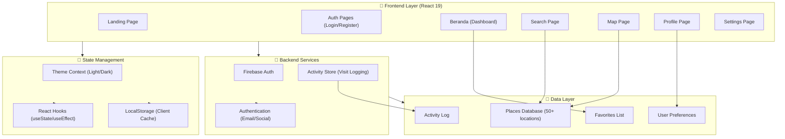

# 🌿 SELASAR

SELASAR is a modern web application designed to help students, remote workers, and freelancers find the ideal coffee shop, coworking space, or study spot based on real-time amenity availability (WiFi speed, power outlets, noise levels, crowd density) and user mood preferences.

---

## 🌟 Key Features

- **Multi-Provider Authentication** — Email/Password plus social logins via Google, Facebook, and GitHub, integrated with Firebase Auth.
- **Mood & Amenity Matching Algorithm** — Proprietary scoring algorithm that calculates a 0–100% match score based on WiFi (25%), Outlets (25%), Crowd Density (25%), Duration (15%), and Rating (10%).
- **Advanced Search & Multi-Criteria Filtering** — Filter 50+ locations across 4 key criteria: WiFi quality, power outlet availability, noise level, and session duration.
- **Interactive Workspace Map** — Visual geographic discovery with category-based markers (Cafe, Coworking, Library, Nature).
- **User Preferences & Personalization** — Save workspace criteria to drive personalized recommendations and automated filter defaults.
- **Activity Tracking & Analytics** — Automatic tracking of up to 20 recent venue visits and activity statistics stored per user session.
- **Favorites & Bookmarking** — One-click bookmarking system for favorite workspaces with cross-device local storage persistence.
- **Dual Theme Engine** — Seamless light and dark mode switching with persistent local state and 500ms CSS transitions.

---

## 🛠️ Tech Stack & Dependencies

| Layer | Technology | Version | Description / Purpose |
|---|---|---|---|
| Framework | React | 19.2.6 | Core frontend library |
| Build Tool | Vite | 8.0.12 | HMR dev server and production builder |
| Styling | Tailwind CSS | 4.3.0 | Utility-first CSS styling engine |
| Routing | React Router DOM | 7.15.1 | Client-side page navigation & routing |
| Auth & Cloud | Firebase | 12.16.0 | Authentication & future Firestore integration |
| Icons | Lucide React / React Icons | 1.21.0 / 5.6.0 | UI icon components |
| Linting | ESLint | 10.3.0 | Code quality and linting |

---

## 📐 System Architecture



---

## 📂 Project Structure

```
selasar-app/
├── public/                      # Static assets
├── src/
│   ├── assets/                  # Brand assets & images
│   │   ├── Daun.png
│   │   ├── Daun_half.png
│   │   └── text-logo.png
│   ├── context/
│   │   └── ThemeContext.jsx    # Light/Dark mode context provider
│   ├── data/
│   │   ├── firebase.js         # Firebase Auth configuration & providers
│   │   ├── locationsData.js    # Location datasets
│   │   └── place.js            # Workspace data models & schemas
│   ├── pages/
│   │   ├── Beranda.jsx         # User dashboard & search entrance
│   │   ├── Landing.jsx         # Public landing page with features & CTA
│   │   ├── Login.jsx           # Auth login form & OAuth popups
│   │   ├── Map.jsx             # Interactive map view
│   │   ├── Profile.jsx         # User profile, history & stats
│   │   ├── Register.jsx        # Account registration
│   │   ├── Searching.jsx       # Advanced multi-filter search grid
│   │   └── Settings.jsx        # Theme & data management
│   ├── utils/
│   │   └── activityStore.js    # LocalStorage visit logging engine
│   ├── App.css                 # Global CSS rules
│   ├── App.jsx                 # Main application routes controller
│   ├── index.css               # Tailwind CSS imports
│   └── main.jsx                # React DOM entry point
├── eslint.config.js            # Linter settings
├── index.html                  # Main HTML document template
├── package.json                # Project dependencies & scripts
└── vite.config.js              # Vite configuration
```

---

## 🚦 Navigation Routes

| Route | Access | Component | Key Features |
|---|---|---|---|
| `/` | Public | `Landing.jsx` | Hero banner, features, testimonials, how-it-works |
| `/login` | Public | `Login.jsx` | Email/Password login, Google/FB/GitHub OAuth, Password Reset |
| `/register` | Public | `Register.jsx` | Account creation, form validation, OAuth signup |
| `/beranda` | Protected | `Beranda.jsx` | Main dashboard, banner carousel, quick search, featured venues |
| `/searching` | Protected | `Searching.jsx` | Filter panel (WiFi, Outlets, Noise, Duration), sort options, match scores |
| `/map` | Protected | `Map.jsx` | Interactive venue map, category filters, detail popups |
| `/profile` | Protected | `Profile.jsx` | User profile, preferences editor, activity history, saved favorites |
| `/settings` | Protected | `Settings.jsx` | Dark mode toggle, privacy controls, data purge, sign out |

---

## 💾 Local Data Persistence Keys

The application uses `localStorage` for client-side caching and state persistence:

- `selasarUser` — User profile data (display name, email, avatar URL).
- `selasar_activity_[email]` — JSON array storing up to 20 recent visit entries.
- `selasar_favorites_[email]` — Array of favorited venue IDs.
- `selasar-dark-mode` — Boolean flag for active UI theme.
- `selasarAvatar_[email]` — Base64 encoded custom profile avatar string.

---

## 🚀 Getting Started

### Prerequisites

- Node.js: v18.0.0 or higher
- npm: v9.0.0 or higher

### Installation

1. Clone the repository:

   ```bash
   git clone https://github.com/selasar/selasar-app.git
   cd selasar-app
   ```

2. Install dependencies:

   ```bash
   npm install
   ```

3. Configure environment variables — create a `.env` file in the root directory and set your Firebase credentials:

   ```
   VITE_FIREBASE_API_KEY=your_api_key
   VITE_FIREBASE_AUTH_DOMAIN=your_project_id.firebaseapp.com
   VITE_FIREBASE_PROJECT_ID=your_project_id
   VITE_FIREBASE_STORAGE_BUCKET=your_project_id.appspot.com
   VITE_FIREBASE_MESSAGING_SENDER_ID=your_sender_id
   VITE_FIREBASE_APP_ID=your_app_id
   ```

4. Start the development server:

   ```bash
   npm run dev
   ```

   Open [http://localhost:5173](http://localhost:5173) in your browser.

5. Build for production:

   ```bash
   npm run build
   ```

---

## 🗺️ Project Roadmap

- **Phase 0 (MVP — Complete):** React 19 core, Auth (Email + Social), Multi-criteria Search, Local Storage activity persistence, Light/Dark mode, Responsive Map view.
- **Phase 1 (Soft Launch):** Firebase Firestore migration, real-time reviews/ratings, photo upload, basic notifications.
- **Phase 2 (Growth):** AI recommendations engine, venue partner analytics dashboard, friend check-ins.
- **Phase 3 (Expansion):** React Native mobile applications (iOS/Android), regional expansion across Southeast Asia.